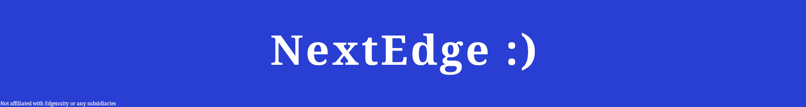

# EdgeNext

## Doesn't work on Chrome!

After some reaserch I found out that chrome has some serious "security" and restricions on these scripts's access to the system. In order for it to ever work on chrome I (or someone) would have to write a Chrome plugin and get it verified by Google.

**Unless Chrome changes things you can use Firefox or Chromium, The plugin is tested on FF**

#### Psa! My reddit acct got banned :(

My reddit account got shadowbanned :(. I requested an appeal but until then r/nextedge and my account are dead

If you have questions you can file an issue or dm me at Twitter(X??): [Here](https://twitter.com/cardcraft_dev)

Firefox: Working
Chrome: Broke :(

### The New EdgeNext Userscript, By a Nerd for Nerds

Recently, Edgenuity has implemented some (bad) checks for userscripts. Of course, they could always just make their courses better, but... **NOPE!**
They decided that we should just suffer more.

I'm working on a new userscript that's made to be as undetectable as possible. At the moment, there isn't much going on with it, but I plan to add some
more features that other similar projects had.

At the moment, it can automatically go to the next slide when the current one is finished and allows you to click while the intro is still rolling.

### Installation

##### Violent Monkey

Open the ViolentMonkey dashboard.
Click the "+" button.
Copy the EdgeNext.js file contents from this repo and paste them into there.
Finally, save.

It should be the same thing for every other manager ever made, but the script is tested with Violent Monkey on Firefox.

### Why Isn't It on Greasy Fork?

Well, I tried, but no matter what I did, the site would just say I can't publish with a disposable email. I'm using a Gmail account, by the way.

### Why should you trust me? / Licensing

EdgeNext is comlpetly Free and Open Source forever, I beleive in the philosophy of software that supports the users freedoms.

This project it now licensed under the GPL3 license requiring any derividevs or software using the project to also be released under GPL3 and open source.

So, why should you trust me? well... You can read the code! If you have any concerns over security you can file an issue and I will try to answer in a timely manner.

The license can be found under **LICENSE.TXT**